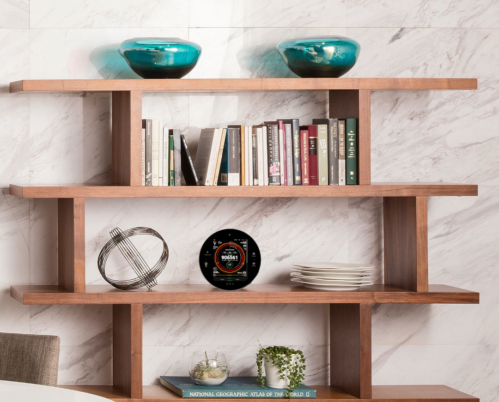

# Circle

This is a quick weekend project, so expect spaghetti code :)

The main idea was to find parts that would be easy to put together and would look good on your desk/shelf. All you need is the round display and Raspberry Pi. Alternatively you can just use hdmi and usb cables and connect the display to your existing computer/node.




Short video demo: https://www.youtube.com/watch?v=7DtQNCBLffI

## Features

- **Full-screen**: Full-screen display with navigation controls buttons or swipes
- **Web Content Display**: Show any website or web application with matching background color
- **Auto-rotation**: Automatically cycle through multiple URLs
- **Screensaver Mode**: Built-in screensaver functionality
- **Settings Management**: Easy configuration through JSON file or Settings Menu
- **Cross-platform**: Works on Windows, macOS, and Linux
- **Weather**: Includes lunar phase tracking, sunrise/sunset, UV Index. Weather data provided by open-meteo.com

## Requirements

- Node.js
- npm

## Hardware to make the same build

- Waveshare 5 inch HDMI Round Touch Display
- Raspberry Pi 5 4GB and Power Supply
- Armor Lite V5 Cooler (not mandatory but recommended)
- 60-Degree Angle Acrylic Plate Display Stand , 4.5 Inch

## Installation

1. Clone or download this repository
2. Install dependencies:
   ```bash
   npm install
   ```

Alternatively you can download prebuilt AppImage for Raspberry Pi Arm64 or Linux x64 in Releases and run it.

## Configuration

The app uses a `config.json` file for configuration. On first run, it will copy the default config to your user data directory where you can modify it. Or you can simply use Settings button.


For sunrise/sunset and UV Index you will need to provide long/lat for your location. You can easily look it up here: https://www.latlong.net/

## Screensaver

'Use "The Quotable Satoshi" screensaver' option will display quotes compiled by Satoshi Nakamoto Institute. Quotes are loaded from the device and the screensaver will work without the Internet. 


Some websites where you can find urls for the Screensaver:
- https://www.bryanbraun.com/after-dark-css/#
- https://lodev09.github.io/web-screensavers/

## Running the Application

### Development Mode
```bash
npm run dev
```

### Production Mode
```bash
npm start
```

## Building the Application

### Create distribution without publishing:
```bash
npm run dist
```

The built applications will be available in the `dist/` directory.

## To auto start it on system boot in linux
Create a file in
````
~/.config/systemd/user/circle.service
````

```bash
[Unit]
Description=Circle
After=graphical.target
After=network.target
Wants=graphical.target

[Service]
Type=simple
ExecStart=/path/to/Circle-0.1.0.AppImage # Replace with the actual path
Restart=on-failure
RestartSec=10
StandardOutput=journal
StandardError=journal

[Install]
WantedBy=default.target
```
Then enable and start the service

```bash
systemctl --user enable circle.service
systemctl --user start circle.service

```
## Moon Phase Color Emoji

If you want some color and texture for the moon phase icon, make sure you have Noto Color Emoji font installed

```bash
sudo apt install fonts-noto-color-emoji

```

## Global keyboard bindings

- Esc - Exit
- Left/Right Arrow - previous/next screen
- F11 - Toggle fullscreen on/off


## Supported Platforms

- **Windows**: Generates NSIS installer
- **macOS**: Creates .app bundle with .icns icon
- **Linux**: Produces AppImage format

